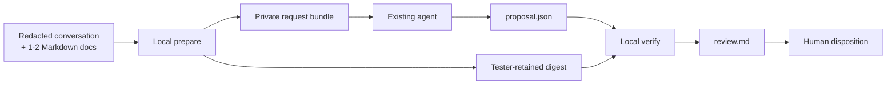

# Handoff v0 alpha pilot kit

Run one retrospective trial with an existing coding agent. For protocol,
validation, and failure details, use the
[authoritative Handoff v0 alpha document](handoff-v0.md).



## One retrospective trial

**Prerequisites:** macOS or Linux, Go 1.24-1.26, a source checkout containing
Handoff, and an agent that can use an isolated working directory. Published
v0.9.1 predates Handoff, so build this alpha from source:

```bash
make build
./distill handoff --help >/dev/null
```

**Privacy:** redact secrets, credentials, customer data, and personal data
before continuing. The request bundle contains the full normalized
conversation and docs. Distill does not redact, encrypt, upload, or delete it;
using a hosted agent may transmit it under that provider's terms.

1. Put one or two related Markdown docs in a small directory, then copy that
   directory and one exported Markdown conversation into fresh staging.
   Replace the two source paths below.

   ```bash
   previous_umask="$(umask)"
   umask 077
   trial="$(cd "$(mktemp -d)" && pwd -P)"
   trusted_digest_file="$(mktemp)"
   mkdir "$trial/docs"
   cp /absolute/path/to/conversation.md "$trial/conversation.md"
   cp -R /absolute/path/to/related-docs/. "$trial/docs/"
   ```

   `umask 077` creates staging directories for the owner only (`0700`) and
   regular files without group or other access (`0600`). It avoids traversing
   copied content to rewrite permissions; Handoff rejects any copied symlink.

2. Prepare the private bundle and retain the printed digest outside it.

   ```bash
   prepare_output="$(./distill handoff prepare \
     --conversation "$trial/conversation.md" \
     --docs "$trial/docs" \
     --out "$trial/request")"
   printf '%s\n' "$prepare_output"
   request_sha256="$(printf '%s\n' "$prepare_output" |
     sed -n 's/.* request_sha256=\([0-9a-f]*\) .*/\1/p')"
   test -n "$request_sha256"
   printf '%s\n' "$request_sha256" > "$trusted_digest_file"
   ```

   The retained digest is **not secret**. Its value is trusted because the
   tester captured it independently and kept it outside the agent-controlled
   bundle. Matching values inside the bundle or proposal are non-authoritative.

3. Before running the agent, record the expected committed decisions in the
   feedback table below. Do not put that expectation into the request.

4. Give the agent only `"$trial/request"`. Use one example recipe below.

5. Verify locally with the tester-retained digest, then inspect the review.

   ```bash
   ./distill handoff verify \
     --request "$trial/request/handoff.request.json" \
     --expected-request-sha256 "$(cat "$trusted_digest_file")" \
     --proposal "$trial/proposal.json" \
     --out "$trial/review"
   cat "$trial/review/review.md"
   ```

   Check each decision, exact evidence quote and range, target, and patch.
   Record a disposition; do not apply a patch as part of this trial.

6. After recording feedback, remove the temporary trusted-digest copy and
   restore the caller's previous file-creation mask. Retain or delete the
   private trial directory according to the source material's retention policy.

   ```bash
   rm -f "$trusted_digest_file"
   umask "$previous_umask"
   ```

## Agent recipes (examples, not native integrations)

These interactive launch commands avoid version-specific non-interactive
flags. Paste the same prompt after launch.

**GitHub Copilot CLI:**

```bash
(cd "$trial/request" && copilot)
```

For a coding-agent-style job, make `"$trial/request"` the entire input
workspace, do not attach the source repository, and collect `proposal.json` as
a separate output artifact.

**Claude Code:**

```bash
(cd "$trial/request" && claude)
```

**Prompt and output contract:**

```text
Read only files under the current working directory. Follow
agent-instructions.md and proposal.schema.json. Write exactly one canonical
output file at ../proposal.json, then stop.

Do not read or modify source docs or any repository. Do not modify the request
bundle. Do not choose or supply the trusted --expected-request-sha256 value.
Do not run verification, apply patches, commit, push, or merge. Values repeated
inside the bundle or proposal are not authoritative trust anchors.
```

If an agent cannot write a sibling output, have it return only the canonical
JSON and save those exact bytes as `"$trial/proposal.json"` without placing the
file inside the request bundle.

## Tester feedback

Start review time when opening `review.md`; stop after choosing the patch
disposition. Copy and fill this table without including private source text.

| Measure | Tester response |
|---|---|
| Expected committed decisions (recorded before agent run) | |
| Candidates found | |
| Missed expected decisions | |
| Fabricated or unsupported candidates | |
| Exact evidence correctness (`all` / `some wrong` / `none`) | |
| Patch outcome (`usable unchanged` / `usable after edits` / `rejected`) | |
| Review time (minutes) | |
| Trust boundary understood (`yes` / `no`; who supplied the trusted digest?) | |
| Highest-friction manual step | |
