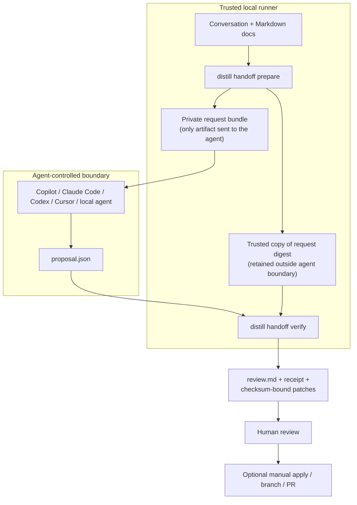

# Distill Handoff v0 alpha

Status: experimental, review-only contract for Markdown in local repositories.

Handoff freezes a consequential conversation and its reference docs into a
portable request, then deterministically verifies and packages an external
agent's proposal for human review.

Running a first retrospective test? Use the
[tester-ready pilot kit](handoff-pilot-kit.md). This document remains the
authoritative protocol and failure-boundary reference.

## Use Handoff with any agent

Handoff is currently an agent-independent CLI and file protocol. It is not an
autonomous agent or a transparent Copilot, Claude Code, Codex, Cursor, or MCP
integration: you run `prepare`, give its private bundle to the agent you already
use, save that agent's `proposal.json`, and run `verify` yourself.
Keep the prepared request immutable. If an agent writes workspace metadata, run
it from a disposable parent containing a request copy and a separate proposal
output, then verify the retained request against that external proposal.



Give the request bundle to your agent with this prompt:

```text
Read agent-instructions.md in the supplied Handoff request bundle. Using only
the bundled contents, output one canonical proposal.json that matches
proposal.schema.json exactly. Do not modify the source docs; write no files
other than proposal.json.
```

Retain an independently trusted copy of the digest printed by `prepare`. The
bundle and proposal may contain the same value, but neither is authoritative for
`--expected-request-sha256`; never source it from the proposing agent or output.

## Contract and guarantees

V0 alpha accepts one exported `.md` conversation and a non-empty local docs tree
containing only `.md` files. It is an evaluation-stage protocol, not an agent
framework, repository writer, general patch engine, adoption claim, or
release-readiness signal.

For the same normalized request bundle and canonical proposal on a supported
macOS/Linux runtime, Handoff produces byte-identical review artifacts, receipts,
patches, and checksums. It validates exact identities and evidence ranges, safe
target paths, source hashes, a bounded unified-diff syntax, clean in-memory
application, non-overlap, and review-only routing.

Decision extraction and patch drafting remain probabilistic external-agent work
and are outside that guarantee. Distill does not call a model or provider,
access the network, infer a decision, draft or apply a patch, modify source docs,
approve a proposal, commit, push, or merge. Every accepted proposal and
candidate route is exactly `require_review`.

## Prepare, propose, and verify

```text
distill handoff prepare --conversation <file> --docs <dir> --out <fresh-dir>
distill handoff verify --request <bundle/handoff.request.json> \
  --expected-request-sha256 <trusted-prepare-digest> \
  --proposal <proposal.json> --out <fresh-dir>
```

`prepare` validates and normalizes the conversation and docs with
`utf8-nfc-lf-v1`, then atomically publishes a private request:

```text
handoff.request.json
agent-instructions.md
proposal.schema.json
inputs/conversation.md
inputs/docs/<relative Markdown paths>
SHA256SUMS
```

The bundle contains no absolute paths, cwd, timestamp, hostname, username,
inode, or environment data. Its normalized files are the authoritative
snapshot; `verify` never revisits the original working tree. The printed
request SHA-256 is an out-of-band trust anchor, so a proposal repeating a
request hash is not trusted. Any changed or unexpected bundle content fails
verification.

The agent emits one canonical proposal matching the bundled draft-2020-12
schema: either sorted `candidate_decisions` or `no_decision` with a reason.
Each candidate binds its decision, exact conversation evidence and byte/line
ranges, frozen target identities, normalized single-file patch, and
`route: "require_review"`.

The stable candidate ID is `decision_` plus the lowercase SHA-256 of
`distill-handoff/candidate/v0alpha1\n` followed by the canonical candidate JSON
with `id` set to `""`. Canonical JSON uses schema field order, two-space
indentation, no HTML escaping, and one final LF.

The accepted diff subset may modify exactly one existing Markdown target.
Creation, deletion, traversal, rename/copy, mode changes, binary/submodule
patches, Git metadata, overlapping candidates, and malformed or stale patches
fail closed.

`verify` applies patches only in memory against the frozen snapshot and
atomically publishes:

```text
review.md
handoff.receipt.json
patches/<candidate-id>.patch
SHA256SUMS
```

No-decision output omits `patches/`. The receipt and checksums bind the request,
proposal, review, verified candidate facts, patched-result hashes, and every
published patch. Reviewers must still judge whether the evidence represents a
real committed decision and whether the proposed change is correct; applying a
patch or creating a branch or PR is always a separate manual action.

## Five-to-ten-minute offline trial

This uses only checked-in fixtures and local commands:

```bash
make build
work="$(cd "$(mktemp -d)" && pwd -P)"

prepare_output="$(./distill handoff prepare \
  --conversation testdata/handoff-v0/retry-policy/conversation.md \
  --docs testdata/handoff-v0/retry-policy/docs \
  --out "$work/request")"
request_sha256="$(printf '%s\n' "$prepare_output" |
  sed -n 's/.* request_sha256=\([0-9a-f]*\) .*/\1/p')"

cp testdata/handoff-v0/retry-policy/proposal.json "$work/proposal.json"
./distill handoff verify \
  --request "$work/request/handoff.request.json" \
  --expected-request-sha256 "$request_sha256" \
  --proposal "$work/proposal.json" \
  --out "$work/review"
cat "$work/review/review.md"
```

The fixture proposal stands in for external-agent output; Distill does not
invoke an agent. Repeat with `api-deprecation` or `brainstorming` (a valid
no-decision package), or run all three deterministic fixtures with:

```bash
make handoff-v0-demo
```

Negative fixtures are under
`testdata/handoff-v0/negative/{unsupported-evidence,stale-target}`.

## Failure, security, and privacy boundary

All validation failures are explicit and nonzero. Handoff rejects unsafe or
colliding paths, unsupported files, invalid UTF-8, NUL and display-control
injection, special files, symlinks, unsafe ownership/modes/ACLs, stale or
unanchored identities, fabricated evidence, malformed patches, direct-allow
routes, existing outputs, and unexpected bundle files.

Outputs are built in a sibling staging directory, synchronized, reverified, and
published by atomic no-replace rename. Failure before publication leaves no
success-shaped destination. A rare post-publication parent-directory sync
failure reports that publication occurred but durability is unconfirmed;
inspect the named output rather than retrying blindly.

The private request contains the full normalized conversation and docs
snapshot. Protect, transmit, and retain it like the originals. Handoff uses
`0700` for request/review directories and `0600` for files, rejects
access-granting ACLs, and fails if those protections drift before verification.
It performs no redaction, secret scanning, encryption, upload, telemetry, or
network access; processes under the same OS account remain inside the local
trust boundary.
